# Listen-to-Reason (L2R)

Code for the paper *LISTEN-to-Reason: Listen with Experts, Retrieve over a Graph, Reason with LLMs*.

- 🌐 **Project page** : https://poonehmousavi.github.io/listen-to-reason-demo/
- 🤗 **Checkpoints** — the tree and the trained heads: https://huggingface.co/poonehmousavi/listen-to-reason
- 📄 **Paper** — preprint link to come

L2R passes audio to a text LLM through an explicit, human-readable tree. Small heads on frozen expert encoders map
each chunk of a clip to nodes of the tree (speech, music, environmental sound). A frozen text-only LLM answers from
these nodes and a transcript; it never hears the clip. Every answer can be traced to the nodes it read, any LLM can
be the reader, and a new domain is added by training one small head.



| Paper | Command | What it does |
|---|---|---|
| Listen (§3.1) | `python -m l2r.dataset`, `python -m l2r.tree` | annotate a pool of training clips; build the tree |
| Retrieve (§3.2) | `python -m l2r.router`, `python -m l2r.retrieve` | train the heads; route a clip to nodes and write the context |
| Reason (§3.3) | `python -m l2r.reason` | a frozen LLM answers from the context |
| Adapt (§3.4) | `python -m l2r.adapt` | add a domain with one head |
| Baselines (§5) | `baselines/` | audio LLMs zero-shot, fine-tuned (QLoRA) and with in-context examples |

Each part is one command that runs its stages in order and skips the finished ones (`--list`, `--from STAGE`,
`--only STAGE`, `--force`). Every stage is also a module of its own (`python -m l2r.<part>.<module> --help`).
`configs/config.yaml` holds every path, model id and hyper-parameter. The repository holds code and two
manifests (`assets/pool.jsonl`, the training clips by path; `assets/dev_items/`, the development items); datasets,
encoder weights and trained heads are downloaded into `data/` and `checkpoints/`.

To evaluate the paper's system, nothing needs training:

```bash
python -m l2r.checkpoints                   # the tree and the trained heads of the paper
python -m l2r.retrieve                      # contexts of MMAU, MMAR and SAKURA
python -m l2r.reason --reader qwen2.5-7b    # the frozen reader answers
```

## ⚙️ Setup

Python 3.10 and a CUDA GPU.

```bash
python3.10 -m venv .venv
source .venv/bin/activate
pip install torch==2.12.0 torchaudio==2.11.0 torchvision==0.27.0 --index-url https://download.pytorch.org/whl/cu130
pip install -r requirements.txt
pip install muq==0.1.0 --no-deps
python -m l2r.selftest          # checks that need no model and no data
```

## 📦 Checkpoints

`python -m l2r.checkpoints` downloads the paper's tree and trained heads (36 MB) from the Hugging Face hub
([poonehmousavi/listen-to-reason](https://huggingface.co/poonehmousavi/listen-to-reason)) into `checkpoints/`:

| Folder | Content |
|---|---|
| `tree/` | `tree.json` (speech, music and sound attributes), `sound_tree.json` (the sound identity classes) |
| `tree_raw/llm_groups.json`, `tree/sound/` | the text LLM's answers used to build the tree, so it can be rebuilt without the LLM |
| `routers/` | the eight region routers, their calibration, and the two domain heads of the paper (`birds_k5`, `marine_k5`) |
| `sound/`, `events/`, `music_properties/`, `question/`, `language/` | the sound-identity heads, the event-timeline head, the music-property heads, the question classifier, the transcript language head |
| `experts/gender_centroids.npz` | the gender expert of the annotation |

The frozen encoders (CLAP, MuQ-MuLan, Whisper, emotion2vec, WavLM-SV, the VGGSound classifier) and the LLMs are
fetched from the hub by their ids on first use (`models:` and `encoders:` in `configs/config.yaml`; a local path
works in place of an id). Three encoders have no loadable hub id. Their sources are listed next to them under
`encoders:`; download the files and replace the `PATH/TO` placeholders with where you put them
(`python -m l2r.checkpoints --verify` checks):

| Weights | Download | Config keys |
|---|---|---|
| PANNs `Cnn14_DecisionLevelMax` | [Zenodo 3987831](https://zenodo.org/records/3987831) (`Cnn14_DecisionLevelMax_mAP=0.385.pth`) and the AudioSet [class list](https://storage.googleapis.com/us_audioset/youtube_corpus/v1/csv/class_labels_indices.csv) | `encoders.panns.weights`, `encoders.panns.labels` |
| BEATs (fine-tuned on AudioSet-2M) | `BEATs_iter3_finetuned_on_AS2M_cpt1.pt` from [lpepino/beats_ckpts](https://huggingface.co/lpepino/beats_ckpts) and the four model files (`BEATs.py`, `backbone.py`, `modules.py`, `quantizer.py`) from [microsoft/unilm](https://github.com/microsoft/unilm/tree/master/beats), in one folder | `encoders.beats.dir` |
| BirdNET v2.4 (bird domain only) | `birdnet.onnx` from [justinchuby/BirdNET-onnx](https://huggingface.co/justinchuby/BirdNET-onnx), then `python -m l2r.checkpoints --birdnet-export` (writes `birdnet_emb.onnx` next to it) | `encoders.birdnet.onnx` |

## 🗂️ Data

Put each dataset in its own folder under `data/` (path `paths.data` in the config). Benchmarks are needed for
inference; the training data only to rebuild the tree or retrain the heads. The expected files are listed in the
loaders (`l2r/benchmarks.py`, `l2r/adapt/data.py`) and in `assets/pool.jsonl`, which names every training clip.

| Folder | Source | Used for |
|---|---|---|
| `MMAU/` | [gamma-lab-umd/mmau-test-mini](https://huggingface.co/datasets/gamma-lab-umd/mmau-test-mini) (downloaded on first use) | benchmark |
| `MMAR/` | [BoJack/MMAR](https://huggingface.co/datasets/BoJack/MMAR) | benchmark |
| `SAKURA/` | [b08202033/SAKURA](https://github.com/b08202033/SAKURA) | benchmark |
| `MMAU-Pro/` | [gamma-lab-umd/MMAU-Pro](https://huggingface.co/datasets/gamma-lab-umd/MMAU-Pro) | benchmark |
| `BirdSet/`, `Watkins/` | [DBD-research-group/BirdSet](https://huggingface.co/datasets/DBD-research-group/BirdSet) (POW), [DBD-research-group/beans_watkins](https://huggingface.co/datasets/DBD-research-group/beans_watkins) | new domains |
| `WavCaps/` | [cvssp/WavCaps](https://huggingface.co/datasets/cvssp/WavCaps) (AudioSet_SL, SoundBible) | pool, sound heads, event head |
| `FSD50K/` | [Zenodo](https://zenodo.org/records/4060432) | pool, sound heads |
| `ESC-50/` | [GitHub](https://github.com/karolpiczak/ESC-50) | pool, sound heads |
| `AudioSet/` | [ontology](https://github.com/audioset/ontology), [strong labels](https://research.google.com/audioset/download_strong.html) | tree, sound heads, event head |
| `Clotho/` | [Zenodo](https://zenodo.org/records/4783391) | pool |
| `AudioCaps/` | [GitHub](https://github.com/cdjkim/audiocaps) | pool |
| `AF-Think/` | [nvidia/AF-Think](https://huggingface.co/datasets/nvidia/AF-Think) | pool, question classifier |
| `MusicCaps/` | [google/MusicCaps](https://huggingface.co/datasets/google/MusicCaps) | pool, music heads |
| `IRMAS/` | [Zenodo](https://zenodo.org/records/1290750) | pool, music heads |
| `FMA/` | [GitHub](https://github.com/mdeff/fma) | pool |
| `GTZAN/` | GTZAN genre collection | pool |
| `TAU2019/` | [Zenodo](https://zenodo.org/records/2589280) | pool |
| `FLEURS/` | `python -m l2r.dataset.fleurs` ([google/fleurs](https://huggingface.co/datasets/google/fleurs)) | pool, language head |
| `IEMOCAP/` | [USC SAIL](https://sail.usc.edu/iemocap/) | pool, gender centroids |
| `LibriSpeech/` | [OpenSLR 12](https://www.openslr.org/12) | pool |
| `RAVDESS/` | [Zenodo](https://zenodo.org/records/1188976) | pool |

## 1. 🎧 Dataset generation — `python -m l2r.dataset`

The tree is generated from a pool of 4,054 training clips from 19 sources (`assets/pool.jsonl`). Each clip is cut
into chunks (3 s for speech and sound, 10 s for music). Each chunk is labelled by expert classifiers and by an audio
LLM (Qwen3-Omni-30B) that fills a fixed template: the regions it hears, one class per attribute, and an optional
1-3 word leaf (`configs/tree_schema.yaml`).

| Stage | Module | Output (`work/sets/pool/`) |
|---|---|---|
| `gender-centroids` | `l2r.dataset.experts --gender-centroids` | the gender expert's two speaker-embedding centroids (IEMOCAP) |
| `chunk` | `l2r.dataset.build chunk` | `rows.jsonl`, the chunk grid and wavs |
| `experts` | `l2r.dataset.build experts` | `fired_<expert>.jsonl`: PANNs, WavLM-SV, emotion2vec, Whisper language id, librosa |
| `annotate` | `l2r.dataset.build annotate` | `fired_qwen3_omni.jsonl`: the audio LLM on every chunk form (several GPU-days, resumable) |
| `music-properties` | `l2r.dataset.build music-properties` | `music_form.jsonl`: period, vocal style, form, rhythm feel, dynamics |
| `assemble` | `l2r.dataset.build assemble` | `index.jsonl`, the label table |

The manifest's `drawn` field records how each clip entered the pool: stratified random rounds over the sources,
keyword search over the sources' captions for classes and leaves with too few clips (for 899 clips the keyword was
the text of a benchmark answer no node named yet, field `target`), and RAVDESS for emotional speech. No benchmark
audio is in the pool.

## 2. 🌳 Tree generation — `python -m l2r.tree`

A single-choice attribute takes the expert's label when its confidence clears a per-attribute threshold and the
audio LLM's label otherwise; a multiple-choice attribute takes the union. Free-text leaves are normalised and
admitted only if they recur in at least 2 clips from at least 2 sources. A text LLM (Llama-3.3-70B) then proposes
groups of synonymous leaves; a group is kept only if it passes a lexical, an acoustic and an identity check. The
identity attributes of environmental sound take their classes and leaves from the AudioSet ontology.

| Stage | Module | Output (`checkpoints/`) |
|---|---|---|
| `raw` | `l2r.tree.publish --raw` | `tree_raw/tree.json`: voted, normalised, admitted |
| `propose`, `check`, `apply` | `l2r.tree.llm_clean` | `tree_raw/llm_groups.json`: the leaf groups that pass every guard |
| `publish` | `l2r.tree.publish` | `tree/tree.json` |
| `audioset-items`, `sound-plan`, `sound-llm`, `sound-verify`, `sound-build` | `l2r.router.audioset items`, `l2r.tree.sound` | `tree/sound_tree.json`: the sound identity classes |

With the paper's checkpoints in place the LLM stages are already done, and `python -m l2r.tree --force --only raw`
then `--only publish` rebuild the tree from the label table without running the LLM. `python -m l2r.tree.summary`
prints the attributes, classes and leaves the heads serve (after step 3).

## 3. 🧭 Router training — `python -m l2r.router`

All encoders are frozen; their chunk embeddings are computed once and cached. A router is a small body on one
encoder's embedding with one head per attribute; a head has one output per node (class or leaf) of its attribute.
Every head trains in minutes on one GPU; settings are in `configs/config.yaml` (`routers:`).

| Stage | Module | Output |
|---|---|---|
| `pairs`, `musiccaps` | `l2r.router.data`, `l2r.router.labelled_music` | the (chunk, attribute) training pairs; the MusicCaps + IRMAS label set |
| `features:<encoder>` | `l2r.router.features` | `work/features/`: CLAP, MuQ-MuLan, Whisper encoder, emotion2vec, WavLM-SV embeddings |
| `train:<router>` | `l2r.router.train --name <router>` | `checkpoints/routers/`: gate, sound, music_clap, music_muq, music_labelled, speech_whisper, speech_emotion, speech_gender |
| `calibrate`, `language` | `l2r.router.calibrate`, `l2r.router.language` | temperature and held-out skill per attribute; language from the transcript's text |
| `audioset-*`, `sound-*` | `l2r.router.audioset`, `l2r.router.sound` | `checkpoints/sound/`: the sound-identity heads on CLAP and BEATs (human AudioSet / FSD50K / ESC-50 labels) |
| `event-head` | `l2r.router.event_head` | `checkpoints/events/`: the event-timeline head on PANNs frames |
| `music-embed`, `music-train` | `l2r.router.music_properties` | `checkpoints/music_properties/`: the music-property heads |
| `question-data`, `question-train` | `l2r.router.question` | `checkpoints/question/`: the question classifier of the sound fallback |

## 4. 🔎 Retrieval — `python -m l2r.retrieve`

```bash
python -m l2r.retrieve                         # MMAU, MMAR, SAKURA
python -m l2r.retrieve --benchmarks mmaupro
```

For each benchmark this transcribes the clips (Whisper-large-v3), routes every 3 s chunk into the tree
(`l2r/retrieve/serve.py`, serving rules under `serve:` in the config), detects the event timeline for questions
about order, duration or counts, and writes the reader's context to `work/contexts/<benchmark>.json`. The
traversal trace (every chunk with its nodes and their probabilities) is in `work/nodes/<benchmark>.json`:

```bash
python -m l2r.retrieve.trace --benchmark mmau --clip MMAU/audio/<id>.wav
```

A context looks like this:

```
Audio analysis of the recording:
Audio graph nodes matched to this recording: cross families present: speech present, environmental sound present; speech gender: female voice; sound animal: dog (Bark).
Transcript: "[0:00.0] Would you like some candy?"
```

## 5. 🧠 Reasoning — `python -m l2r.reason`

```bash
python -m l2r.reason --reader qwen2.5-7b                       # MMAU, MMAR, SAKURA
python -m l2r.reason --reader qwen2.5-7b --benchmarks mmaupro
python -m l2r.reason --model <hf id> --name <name>             # any other LLM; selects its prompt template first
```

The reader scores the option letters in one forward pass and reports `ours_poe` (the context plus a weak prior
from the same reader without context). `configs/readers.yaml` lists the 26 readers of the paper with their
templates. Results are written to `work/results/`.

## 6. 🐦 Adding a domain — `python -m l2r.adapt`

A new domain is one new attribute with one head on a frozen encoder, trained on k labelled clips per class.

```bash
python -m l2r.adapt --domain birds --k 5        # also: marine, and any k
```

| Stage | Module | What it does |
|---|---|---|
| `data`, `build` | `l2r.adapt.data`, `l2r.adapt.domain build` | the evaluation items; the label set `birds_k5` (k clips per species and a `none` class) |
| `features`, `train`, `probe` | `l2r.router.features`, `l2r.router.train`, `l2r.adapt.domain probe` | the head (settings under `adapt:` in the config); routing accuracy without a reader |
| `context`, `reader` | `l2r.retrieve.context --domains birds_k5 --tree-only`, `l2r.reason` | the traversal with the new head, the context without the transcript, the frozen reader on it |

`python -m l2r.retrieve --benchmarks mmau --domains birds_k5,marine_k5` adds the heads to another benchmark (the
forgetting check).

## 📏 Baselines

```bash
python -m baselines.audio_llm --benchmark mmau                          # an audio LLM hears the clip (Qwen2.5-Omni by default)
python -m baselines.qlora --domain birds --k 5 --epochs 8               # the audio LLM fine-tuned on the same k clips per class
python -m baselines.audio_llm --benchmark birds --adapter work/qlora/birds_k5
python -m baselines.in_context --domain birds --shots 0,1,3,5           # the same clips as in-context examples
```

## 📚 Citation

```bibtex
@article{mousavi2026listen,
  title   = {LISTEN-to-Reason: Listen with Experts, Retrieve over a Graph, Reason with LLMs},
  author  = {Mousavi, Pooneh and others},
  journal = {Preprint},
  year    = {2026}
}
```

## ✉️ Contact

Questions or problems: mousavi dot pooneh at gmail dot com.
